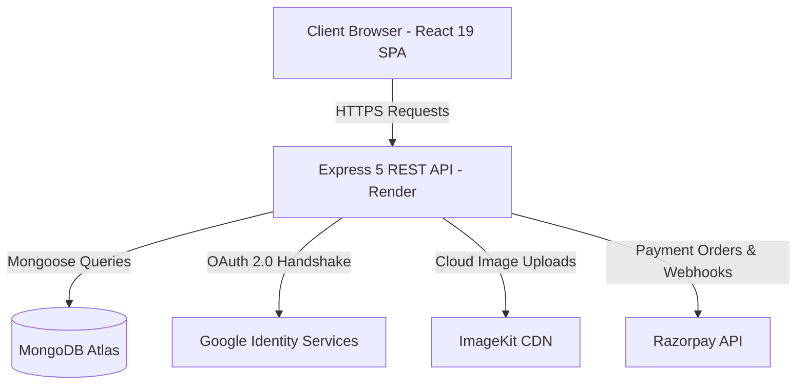

# 🛍️ VEYRO — Modern Apparel & Multi-Vendor E-Commerce Platform

[](https://veyro-cwwj.vercel.app)
[](https://veyro-r5ci.onrender.com)
[](https://react.dev/)
[](https://nodejs.org/)
[](https://www.mongodb.com/)

> **VEYRO** is a full-stack, production-grade multi-vendor e-commerce marketplace built for luxury apparel and fashion collections. It features full dual-role portals (Buyer & Seller), real-time variant management, Razorpay payment gateway integration, ImageKit cloud storage, Google OAuth 2.0 authentication, and a responsive luxury UI.

---

## 🚀 Live Demos & Deployment Links

| Environment | Platform | URL |
|---|---|---|
| **Frontend Web App** | Vercel | [https://veyro-cwwj.vercel.app](https://veyro-cwwj.vercel.app) |
| **Backend REST API** | Render | [https://veyro-r5ci.onrender.com](https://veyro-r5ci.onrender.com) |

---

## ✨ Key Features & Highlights

### 🛒 Buyer Experience
- **Interactive Product Catalog**: Instant product search, collection filtering (Men, Women, Shop), and price/attribute sorting.
- **Dynamic Product Variants**: Seamless switching between main product editions and variant options (Color swatches, Numeric Jeans/Pants sizes, Letter sizes).
- **Persistent Cart & Real-Time Sync**: Add to bag with quantity adjustment, instant total price recalculation, and stock validation.
- **On-Screen Flash Toast System**: High-end floating toast alerts informing unauthenticated users to log in with direct single-click redirection.
- **Seamless Checkout & Address Collection**: Collects customer contact details and delivery addresses prior to payment authorization.
- **Razorpay Payment Integration**: Integrated online checkout with automated cart clearing upon successful payment verification.
- **Customer Order Tracking**: View order status history and detailed purchased product imagery.

### 👔 Seller Studio Dashboard
- **Seller Analytics**: Overview cards showing Total Products Published, Catalog Stock Value, and Unread Order Alerts.
- **Product Management**: Create, edit, and delete products with multi-image cloud uploads.
- **Variant & Inventory Management**: Add variant SKUs with distinct attributes, prices, custom images, and real-time stock updates.
- **Order Dispatch Management**: View incoming buyer orders with full customer contact info, address details, and update order statuses (*Processing*, *Shipped*, *Delivered*).
- **Unread Order Notifications**: Badge indicators in navigation for new buyer orders with timestamp tracking.

### 🔒 Authentication & Security
- **Dual Authentication**: Local Email/Password auth alongside **Google OAuth 2.0** single sign-on (SSO) via Passport.js.
- **Role-Based Access Control (RBAC)**: Middleware enforcing strict separation between `buyer` and `seller` permissions.
- **Token Security**: Dual support for HTTP-only cookies and `Authorization: Bearer` headers.
- **Password Protection**: BcryptJS salted password hashing.

---

## 🛠️ Technology Stack

### **Frontend**
- **Core**: React 19, React Router v7/v8
- **State Management**: Redux Toolkit (`@reduxjs/toolkit`), React Redux
- **Styling**: TailwindCSS v4 (`@tailwindcss/vite`), Custom Utility CSS
- **HTTP Client**: Axios with Interceptors for JWT authorization
- **Payments**: `react-razorpay`
- **Build Tool**: Vite 8

### **Backend**
- **Runtime & Framework**: Node.js, Express 5
- **Database**: MongoDB Atlas with Mongoose 9 ORM
- **Authentication**: Passport.js (Google OAuth 2.0 Strategy), JSON Web Tokens (`jsonwebtoken`), BcryptJS
- **Validation**: Express Validator
- **Cloud Media**: ImageKit Node.js SDK (`@imagekit/nodejs`), Multer (Memory Storage)
- **Payment Processing**: Razorpay Node.js SDK (`razorpay`)
- **Logging & Utilities**: Morgan, Cookie-Parser, CORS, Dotenv

---

## 🏗️ Architecture & Database Design



### Core Schemas & Models
- **`User`**: `email`, `password`, `contact`, `fullname`, `googleId`, `role` (`buyer` | `seller`)
- **`Product`**: `tittle`, `description`, `price` (`amount`, `currency`), `images`, `category`, `seller`, `variants` (Subdocuments with `attributes`, `stock`, `images`, `price`)
- **`Cart`**: `user`, `items` (`product`, `variant`, `quantity`, `price`), `totalPrice`
- **`Order / Payment`**: `user`, `seller`, `items`, `amount`, `razorpayOrderId`, `razorpayPaymentId`, `shippingAddress`, `orderStatus`

---

## 🔌 API Endpoints Summary

### 🔑 Auth Routes (`/api/auth`)
- `POST /api/auth/register` — Register new buyer or seller account
- `POST /api/auth/login` — Authenticate user & issue JWT
- `GET /api/auth/me` — Fetch currently authenticated user profile
- `POST /api/auth/logout` — Clear session cookies & log out
- `GET /api/auth/google` — Initiate Google OAuth login flow
- `GET /api/auth/google/callback` — Google OAuth redirect handler

### 🛍️ Product Routes (`/api/products`)
- `GET /api/products` — Fetch all published products (with search/filter query support)
- `GET /api/products/product/:id` — Fetch single product details with variants
- `GET /api/products/seller` — Fetch seller's published catalog (*Seller Auth Required*)
- `POST /api/products` — Publish new product with image uploads (*Seller Auth Required*)
- `PUT /api/products/seller/product/:id` — Update existing product details
- `DELETE /api/products/seller/product/:id` — Delete product from catalog
- `POST /api/products/seller/product/:id/variants` — Add variant SKU to product

### 🛒 Cart Routes (`/api/cart`)
- `GET /api/cart` — Fetch user's cart items (*Auth Required*)
- `POST /api/cart/:productId/:variantId` — Add product variant to cart (*Auth Required*)
- `PATCH /api/cart/:cartItemId` — Update item quantity in cart
- `DELETE /api/cart/:cartItemId` — Remove item from cart
- `DELETE /api/cart` — Clear entire cart contents

### 💳 Payment & Orders Routes (`/api/payment`)
- `POST /api/payment/create/order` — Create Razorpay payment order
- `POST /api/payment/verify` — Verify Razorpay signature & record order
- `GET /api/payment/seller/orders` — Fetch orders received by seller (*Seller Auth Required*)
- `PATCH /api/payment/seller/orders/status` — Update order status (*Seller Auth Required*)

---

## ⚙️ Local Development Setup

### Prerequisites
- Node.js >= v18
- MongoDB Atlas account or local MongoDB instance
- ImageKit.io account (for media storage)
- Razorpay Dashboard test credentials

### 1. Clone Repository
```bash
git clone https://github.com/waisshaikh/snitch.git
cd snitch
```

### 2. Environment Configuration
Create a `.env` file inside the `Backend/` directory:

```env
PORT=5000
MONGODB_URI=your_mongodb_connection_string
JWT_SECRET=your_super_secret_jwt_key

GOOGLE_CLIENT_ID=your_google_oauth_client_id
GOOGLE_CLIENT_SECRET=your_google_oauth_client_secret

IMAGEKIT_PUBLIC_KEY=your_imagekit_public_key
IMAGEKIT_PRIVATE_KEY=your_imagekit_private_key
IMAGEKIT_URL_ENDPOINT=https://ik.imagekit.io/your_username

RAZORPAY_KEY_ID=your_razorpay_key_id
RAZORPAY_KEY_SECRET=your_razorpay_key_secret

BACKEND_ORIGIN=http://localhost:5000
FRONTEND_ORIGIN=http://localhost:5173
```

### 3. Install & Start Backend
```bash
cd Backend
npm install
npm run dev
```
*Backend will start on `http://localhost:5000`*

### 4. Install & Start Frontend
```bash
cd ../frontend
npm install
npm run dev
```
*Frontend will start on `http://localhost:5173`*

---

## 🎨 Design System & UI Principles

- **Editorial Fashion Typography**: Clean headings powered by Google Fonts (Outfit / Serif accents).
- **Glassmorphism Notifications**: Floating high-contrast notification banners with backdrop blur for key user actions.
- **Responsive Grid**: Fluid layout transitioning smoothly from single-column mobile view to 12-column desktop split screens.
- **Zero Generic Placeholders**: Dynamic cloud-hosted product imagery and real-time loading skeletons.

---

## 👤 Author & Contact

**Wais Shaikh**  
- **GitHub**: [@waisshaikh](https://github.com/waisshaikh)  
- **Project Repository**: [waisshaikh/snitch](https://github.com/waisshaikh/snitch)  

---

*Thank you for exploring VEYRO! Built with precision, performance, and attention to user experience.*
